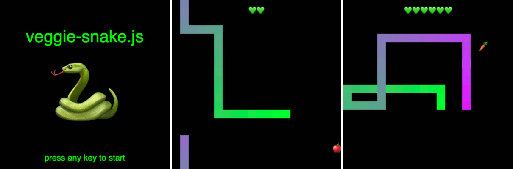
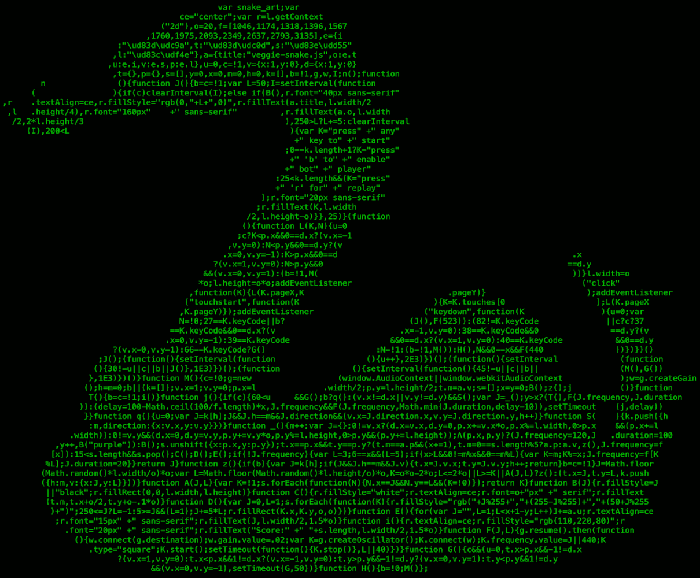

veggie-snake.js
===============

Snake is super green and loves to eat vegetables.

🥕 Carrots make for good eyesight! Snake knows that is certainly a fact because it was once stated by someone with a firm voice and a very British accent.

🍎 An apple a day keeps the doctor away! Snake enjoys the mesmerizing electronic tunes after four apples.

💚 After eating an apple Snake feels so healthy that a snake bite will do no harm.

Game controls
-----------------
* <kbd>△</kbd> snake up
* <kbd>▽</kbd> snake down
* <kbd>◁</kbd> snake left
* <kbd>▷</kbd> snake right
* <kbd>b</kbd> veggie robot brain
* <kbd>r</kbd> replay after game over
* <kbd>esc</kbd> escape game

Screenshots
-----------

